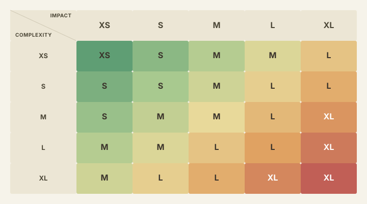

# Testing Scope Framework

Методология для определения объективного, воспроизводимого уровня тестирования задачи (feature/bugfix) на основе двух независимых осей — **Impact Analysis** и **Complexity Dev** — вместо решения "на глаз", зависящего от опыта конкретного QA-инженера.

Документ не заменяет аналитическое мышление QA, а задаёт **минимальный гарантированный уровень проверки**, предсказуемый независимо от того, кто именно тестирует задачу.

## Can we expect two independent QA engineers to complete the same task with the same result?

*Risk-based test design · Production practice*

Imagine two identical parallel universes with one exception: the QA engineer assigned to the task. How can we shape the QA process for an AAA system with a complex Core Gameplay structure so that we can expect the same result in both universes?

**My experience in AAA suggests that the individual specialist has too much influence on the outcome. So what can we do about it?**

**Same task. Different reasoning.**

Identical input — same change request:

- Universe A — QA A — Personal interpretation — Scope A
- Universe B — QA B — Personal interpretation — Scope B

Experience and individual interpretation can produce two valid-looking but materially different test scopes.

Individuality is valuable — until it leads to a poor outcome. Individuality can create frameworks like this. It can also create the reasons such frameworks are needed.

When we talk about quality, we mean bringing the expected and actual results into alignment. We cannot accept a situation in which we do not know what to expect.

## A universal AAA checklist does not exist.

*The original problem*

A check is not inherently mandatory or optional.

This makes it important not to settle for the apparently safest conclusion: test everything. In an AAA environment, deciding what does not need to be tested is the hardest — and perhaps the most important — question.

This framework builds that decision around three parameters:

| # | Parameter | Question |
|---|---|---|
| 01 | **Testing depth** | How thoroughly should the changed behavior itself be examined? |
| 02 | **Testing breadth** | How far should regression expand across connected systems? |
| 03 · expert layer | **Distrust in the logic** | Where does an experienced QA engineer believe the calculated minimum is insufficient? |

Depth defines vertical coverage. It determines how many rules, states, boundaries, combinations and failure paths must be investigated inside the changed functionality.

Distrust is the space for individuality and QA expertise. It is always applied on top of the depth and breadth calculation—and it remains visible, explainable and open to discussion.

Full product → Connected systems → Feature boundaries → Changed behavior.

Maximum coverage is not automatically maximum quality. When every layer is treated as equally necessary, scope becomes expensive but the reasoning behind it remains invisible.

The framework helps explain what does not need to be tested — and why.

## Содержание

- [Can we expect two independent QA engineers to complete the same task with the same result?](#can-we-expect-two-independent-qa-engineers-to-complete-the-same-task-with-the-same-result)
- [A universal AAA checklist does not exist.](#a-universal-aaa-checklist-does-not-exist)
- [Зачем это нужно](#зачем-это-нужно)
- [Scope](#scope)
- [Base Workflow](#base-workflow)
- [Матрица тестирования](#матрица-тестирования)
- [Калькулятор](#калькулятор)
- [Уровни тестирования](#уровни-тестирования)
- [Финальный чек-лист](#финальный-чек-лист)
- [Best Practices](#best-practices)
- [Частые проблемы](#частые-проблемы)

## Зачем это нужно

Без формального критерия объём тестирования задачи определяется субъективно: один инженер регрессит всё подряд "на всякий случай", другой ограничивается позитивным сценарием. Оба исхода — проблема: избыточное тестирование тратит время команды, недостаточное — пропускает риски.

Framework решает это, раскладывая объём тестирования на два независимых, уже существующих в большинстве трекеров понятия:

- **Impact Analysis** — говорит, **сколько** тестировать (ширина регресса)
- **Complexity Dev** — говорит, **насколько глубоко** тестировать (глубина валидации логики)

Результирующее значение — **Impact Analysis QA** — конкретный уровень тестирования (XS–XL) с чётким перечнем обязательных проверок.

## Scope

Framework распространяется на ветки, соответствующие Base Workflow:

- реализация нового функционала
- исправление старых или новых проблем (багфиксы)
- рефакторинги и технические изменения, не влияющие на пользовательский опыт
- экспериментальные изменения формата R&D и проверка гипотез

> [!WARNING]
> Framework **не распространяется** на hotfix-процесс — ветки, отвечающие критериям срочности решения проблемы или иной экстренной активности. Для hotfix-веток должен существовать отдельный, более быстрый процесс (Hot Workflow), не описанный в этом документе.

## Base Workflow

Порядок действий при работе с задачей, попадающей в scope:

1. Ознакомление с задачей и всей прилагаемой документацией
2. Ознакомление с Impact Analysis задачи
3. Ознакомление с Complexity Dev задачи
4. Проверка на соответствие выставленного Impact'а и Complexity Dev — QA не только исполняет эти значения, но и валидирует их корректность
5. Стадия тестирования в соответствии с финализированным Impact'ом и Complexity Dev
6. Финализация QA-процесса при необходимости (продвижение по Bug Life Cycle)

> [!IMPORTANT]
> Шаг 4 — критичный: от корректности выставленных значений зависит, насколько адекватным окажется весь последующий объём работы. Валидация Impact/Complexity требует чётких критериев их выставления; критерии выставления Complexity Dev пока не задокументированы — это открытая задача.

## Матрица тестирования

Результирующий уровень тестирования (**Impact Analysis QA**) рассчитывается по формуле:

```
full_weight = impact_weight + complexity_weight = 1

impact_analysis_qa = impact_weight * impact_level_value + complexity_weight * complexity_level_value
```

Базовые значения:

| Параметр | Значение |
|---|---|
| `impact_weight` | 0.6 |
| `complexity_weight` | 0.4 |
| `level_value`: XS / S / M / L / XL | 1 / 2 / 3 / 4 / 5 |

Вес Impact Analysis выше веса Complexity Dev, т.к. регрессионные риски (ширина) приоритетнее глубины валидации новой логики.

Результат округляется **в большую сторону** (safety margin) и ограничивается диапазоном 1–5.

**Пример:** Impact = XS (1), Complexity = S (2):

```
impact_analysis_qa = 0.6 * 1 + 0.4 * 2 = 1.4 → CEIL → 2 = S
```

Полная матрица результатов при базовых весах:



| Complexity \ Impact | XS | S | M | L | XL |
|---|---|---|---|---|---|
| **XS** | XS | S | M | M | L |
| **S** | S | S | M | L | L |
| **M** | S | M | M | L | XL |
| **L** | M | M | L | L | XL |
| **XL** | M | L | L | XL | XL |

> [!CAUTION]
> Если в задаче не выставлен Complexity Dev, допускается упрощение `Impact Analysis QA = Impact Analysis`, но это не рекомендуется — увеличивает погрешность определения уровня. Любые невыставленные значения, важные для дальнейшей работы QA, должны быть донесены до автора задачи.

## Калькулятор

[`calculator.html`](calculator.html) — самодостаточный HTML-инструмент (без сборки и зависимостей, открывается прямо в браузере), реализующий формулу выше:

- выбор Impact Analysis и Complexity Dev (XS–XL)
- настраиваемые веса с автоматической нормализацией к сумме 1
- визуализация результирующего уровня и объяснение расчёта (`Score = ... → CEIL → уровень`)
- чек-лист выбранного уровня с наследованием проверок предыдущих уровней ("всё из XS +", "всё из S +" и т.д.)
- экспорт итогового чек-листа в разметку, пригодную для вставки в комментарий тикета (Jira wiki markup)

> [!NOTE]
> Калькулятор — демонстрационный концепт: чек-листы по уровням покрывают общий случай, а не исчерпывающий список проверок, а индикаторы прогресса в карточках уровней пока не интерактивны. Наполнение более детальными сценариями по уровням — открытая задача.

## Уровни тестирования

Различия между уровнями определяются тремя понятиями:

1. **Глубина проверки** — определяется Complexity Dev (например: проверить не только конечный результат, но и корректность промежуточного расчёта/формулы, лежащей в основе логики)
2. **Ширина проверки** — определяется Impact Analysis (например: проверить не только изменённый модуль, но и его влияние на смежные модули — регресс)
3. **Недоверие к логике** — субъективный, но всегда присутствующий фактор (например: "эта зависимость звучит нелогично и рискованно")

> [!NOTE]
> Количество конкретных кейсов — лишь косвенное следствие анализа этих трёх понятий, поэтому единый стандарт проверок, покрывающий 100% задач, невозможен. Ниже описано типовое поведение для большинства случаев.

Сквозной пример — механика **Reaction Experiment** из тестового Unreal Engine проекта [qalab](https://github.com/msgrigorovich/qalab): `FReactionModel::Evaluate` по входным параметрам `AmountA` / `AmountB` / `Temperature` рассчитывает `Yield` (выход реакции) и `ReactionTime`, а `UExperimentComponent` оборачивает эту чистую функцию в состояние `Idle → Ready → Running → Completed/Failed/Cancelled`.

### Impact Analysis QA = XS — Minimal Validation

**Цель:** проверка локального изменения. **Регрессионный охват:** точка изменения.

| Параметр | Описание |
|---|---|
| Смысл | Проверка корректности конкретного изменения без анализа системы |
| Что это значит | Проверяем, что изменение работает в точке применения, но не исследуем поведение за её пределами |
| Глубина | Поверхностная (без анализа логики) |
| Ширина (регресс) | Точка изменения — конкретный сценарий, ради которого сделана задача |
| Граница уровня | Не проверяются альтернативные пути, состояния, зависимости |

**Пример задачи:** добавить в `FExperimentParameters` boolean-флаг `bSafetyLockEnabled`, при котором `UExperimentComponent::StartExperiment()` сразу возвращает `false`, не запуская реакцию.

- Флаг = true → `StartExperiment()` → возвращает `false`, состояние не переходит в `Running`
- Флаг = false → `StartExperiment()` → работает как раньше, `FReactionModel::Evaluate` вызывается штатно
- Регрессионных проверок нет — только реализованный флаг

### Impact Analysis QA = S — Basic Validation

**Цель:** базовая валидация логики. **Регрессионный охват:** точка изменения + ближайшие сценарии.

| Параметр | Описание |
|---|---|
| Смысл | Проверка базовой логики и очевидных отклонений |
| Что это значит | Проверяем не только позитивный сценарий, но и простые отклонения поведения |
| Глубина | Низкая (базовая логика) |
| Ширина (регресс) | Точка изменения + ближайшее окружение — сценарии, напрямую использующие ту же логику |
| Граница уровня | Не проверяются сложные состояния и переходы |

**Пример задачи:** заменить статичный флаг на константный threshold `MaxSafeTemperature` — `FReactionModel::Validate` должен полностью отклонять реакцию (а не просто штрафовать `Yield`, как сейчас), если `Temperature` превышает этот порог.

- `Temperature` в пределах старого безопасного диапазона → поведение не изменилось
- `Temperature` превышает `MaxSafeTemperature` → `Validate` возвращает `false`, состояние → `Failed`, `FailureReason` заполнен
- `Temperature` == `MaxSafeTemperature` ровно → реакция всё ещё принимается (граница включительно)
- Регрессионная проверка: задокументированные граничные кейсы `MinimumTemperatureBoundaryIsAccepted` / `MaximumTemperatureBoundaryIsAccepted` из существующего набора тестов не должны сломаться ниже нового порога

### Impact Analysis QA = M — Deep Validation

**Цель:** глубокая проверка механики. **Регрессионный охват:** вся механика.

| Параметр | Описание |
|---|---|
| Смысл | Проверка механики как целостной логической системы |
| Что это значит | Рассматриваем механику как набор состояний, переходов и зависимостей |
| Глубина | Средняя–высокая |
| Ширина (регресс) | Вся механика + все сценарии внутри неё |
| Граница уровня | Не выходим за пределы механики |

**Пример задачи:** сделать `MaxSafeTemperature` зависимым не только от `Temperature`, но и от соотношения `AmountA`/`AmountB` — сильно рассогласованная пропорция реагентов должна снижать безопасный температурный порог (модель уже считает `RatioDeviation` для штрафа `Yield`, теперь она же влияет и на порог отказа).

- Проверка каждого входного параметра отдельно (`AmountA`/`AmountB`/`Temperature`: min/normal/max)
- Проверка всех значимых комбинаций параметров (сбалансированная пропорция + высокая температура, рассогласованная пропорция + умеренная температура и т.д.)
- Проверка переходов между состояниями (`Ready → Failed` ровно на новой динамической границе, `Ready → Completed` чуть ниже неё)
- Пограничные кейсы для новой зависимости
- Регрессионная проверка: `OptimalRatioProducesExpectedYield` (базовый позитивный тест проекта, `Yield == 100%`) не должен измениться

### Impact Analysis QA = L — System Validation

**Цель:** системная проверка. **Регрессионный охват:** механика + смежные системы.

| Параметр | Описание |
|---|---|
| Смысл | Проверка взаимодействия механики с другими системами |
| Что это значит | Проверяем не только механику, но и как она влияет на другие системы и зависит от них |
| Глубина | Высокая |
| Ширина (регресс) | Механика + связанные системы и сценарии взаимодействия |
| Граница уровня | Не покрывает весь продукт целиком |

**Пример задачи:** новый отказ по температурному порогу должен доходить до `FRegressionAnalyzer` — прогон `AReactionTestStand` (sweep конфигураций), который стал чаще упираться в порог, обязан показать это как рост `FailureRate` в `CompareToBaseline()`, а не потеряться в усреднённых `Yield`/`ReactionTime`.

- Полная проверка логики `FReactionModel`/`UExperimentComponent`, описанной на уровнях выше
- Полный регресс пайплайна Test Stand → Regression: `ComputeBaselineAggregatesRunRecordsPerMetric`, `IntentionalReactionTimeRegressionTriggersWarning`, `TooFewRunsSkipsComparison` — теперь при включённом новом пороге

### Impact Analysis QA = XL — Critical Validation

**Цель:** критическая проверка. **Регрессионный охват:** кросс-системный / кросс-командный регресс.

| Параметр | Описание |
|---|---|
| Смысл | Проверка с максимальным уровнем недоверия к системе |
| Что это значит | Предполагаем, что система может ломаться в неожиданных местах |
| Глубина | Максимальная |
| Ширина (регресс) | Кросс-системный + кросс-доменный регресс |
| Граница уровня | Практически отсутствует (преобладание проверок на негативные сценарии) |

**Пример задачи:** сделать отказ по новому порогу release-blocking сигналом — экспортировать его через `UQATelemetryLibrary` (CSV/JSON) и завязать на него `FRegressionAnalyzer`, так, чтобы случайный сдвиг порога был пойман раньше, чем сломает схему телеметрии или тесты-якоря, на которые опирается весь остальной набор (`OptimalRatioProducesExpectedYield`, `RunsPerConfigRepeatsSameConfigDeterministically`).

- Полная проверка всей системы `FReactionModel`/`UExperimentComponent` и всех смежных модулей (уровень L: Test Stand, Regression, Telemetry)
- Упор на нетипичные, экстремальные и редко встречающиеся сценарии (например, порог схлопывается до значения ниже документированного минимума температуры — механика начинает отклонять любую конфигурацию)
- Проверка `InteractionComponent`/станций, которые конфигурируют и запускают эксперимент — не сломались ли сценарии игрока при изменении допустимого диапазона параметров
- Производительность: `Validate()` теперь делает больше работы на каждый вызов — sweep из множества конфигураций и прогонов (`AReactionTestStand`) не должен ощутимо замедлиться
- Обязательное привлечение кросс-командного тестирования со стороны владельцев смежных систем

## Финальный чек-лист

Сводная таблица типов проверок и их обязательности по уровням (`+` обязательно, `-` не требуется):

| Тип проверки | XS | S | M | L | XL |
|---|---|---|---|---|---|
| Соответствие требованиям | + | + | + | + | + |
| Проверка точки изменения | + | + | + | + | + |
| Позитивные сценарии | + | + | + | + | + |
| Негативные сценарии | - | + | + | + | + |
| Граничные значения | - | + | + | + | + |
| Проверка переходов состояний | - | - | + | + | + |
| Проверка комбинаторики действий | - | - | + | + | + |
| Проверка расчётов / формул | - | - | + | + | + |
| Проверка данных (консистентность) | - | - | + | + | + |
| Проверка механики (end-to-end) | - | - | + | + | + |
| Проверка взаимодействия систем | - | - | - | + | + |
| Регресс локальной механики | - | - | - | + | + |
| Регресс смежных механик | - | - | - | + | + |
| Регресс всех механик | - | - | - | - | + |
| Нестандартные сценарии | - | - | - | - | + |
| Экстремальные ситуации | - | - | - | - | + |
| Производительность | - | - | - | - | + |
| Кросс-командное взаимодействие | - | - | - | - | + |

## Best Practices

Практики ниже актуальны как для задач с новой функциональностью, так и для работы с воспроизведением багов.

### Работа с отладкой на уровне логики

Для задач с уровнем тестирования ≥ M взаимодействие с исходной логикой (а не только с UI/конечным поведением) становится необходимым:

- отключение части логики от основной функции и проверка работы именно точки изменения в изоляции
- логирование вызова функции для проверки соответствия триггерам, описанным в требованиях
- установка breakpoint на нужной функции для проверки самого факта и контекста вызова
- прямая манипуляция внутренним состоянием для воссоздания комбинаций ситуаций, которые сложно/долго воссоздать через обычный пользовательский сценарий

Если объединяются несколько ранее независимых функций/модулей — необходимо тестировать не только новую объединённую логику, но и регресс по логике, которая раньше была раскидана по отдельным местам.

### Работа с логами

Своевременность логирования — один из признаков ожидаемо работающей системы. Недостаточное логирование — повод вернуть задачу на доработку; чрезмерное логирование — потенциальная проблема для производительности.

Логи особенно полезны в кейсах, где вызовы происходят за короткий промежуток времени и разница между двумя похожими условиями не видна "невооружённым глазом" (например, гонка между двумя почти одновременными триггерами). В таких случаях единственный надёжный способ подтвердить, какое именно условие сработало — сверка с логами, а не наблюдение за конечным поведением.

### Работа с профилированием производительности

> [!NOTE]
> Работа с трейсом производительности, как правило, — следствие недоверия к системе или субъективного ощущения деградации, но иногда должна выполняться по регламенту (например, если новая логика начинает выполняться на каждый кадр/такт вместо разового вызова).

Практика: воссоздать ситуацию, вызывающую новую логику, снять трейс до и после изменения, сравнить затраты по времени на вызов затронутого пути.

### Работа со стендами

> [!TIP]
> Работа со стендами (тестовыми окружениями с фиксированным набором ситуаций) и повторяемыми тестовыми сценариями — одна из ключевых объективных практик тестирования. Рекомендуется использовать стенды как обязательный критерий приёмки для задач, где результат сложно оценить "на глаз" (изменения в вероятностных/статистических механиках, ML-модели, ранжирование и т.д.).

Практика: создать отдельные ветки/окружения "до" и "после" изменения (не переиспользуя существующие рабочие ветки, чтобы не портить их диффы), прогнать одинаковый стенд ситуаций на обеих и сравнить агрегированную статистику.

### Работа с телеметрией

Телеметрия — один из ключевых объективных критериев приёмки, наряду со стендами. Область применения широка: от проверки корректности события до оценки серьёзности и приоритета бага, который невозможно воспроизвести вручную.

Практика: сформулировать логическое условие проблемы, перевести его в запрос к аналитическому хранилищу, получить частоту воспроизведения до и после фикса — это переводит оценку приоритета из догадки в измеримую величину.

> [!CAUTION]
> При некорректно подобранных условиях запроса данные телеметрии будут "лгать", т.е. вредить больше, чем помогать — стоит привлекать команду аналитиков для валидации сложных запросов.

### Работа с diff'ом Pull Request

Анализ diff'а — превентивная мера выявления рисков, не всегда очевидных из описания задачи:

- ширина затронутого функционала → важность регрессионных проверок
- глубина изменений → точечность реализованной логики
- наличие новых файлов или изменений в специфичных путях (сетевой код, конфигурация сборки и т.д.) → какие дополнительные конфигурации/типы сборки нужно проверить отдельно, если CI не покрывает их по умолчанию

> [!TIP]
> Полезная, но не заменяющая ручной анализ практика — передавать diff PR на анализ LLM для генерации дополнительных вариантов проверок и рисков; итоговая ценность такого фидбека растёт вместе с объёмом контекста о специфике проекта, которым модель располагает.

### Переиспользуемые тестовые сценарии

В большинстве задач для воспроизведения похожих ситуаций используются одни и те же приёмы (отладочные конфигурации, тестовые скрипты, сохранённые сценарии). Если у команды есть возможность сохранять и переиспользовать такие заготовки (сниппеты, сохранённые графы логики, шаблоны запросов к телеметрии) — стоит вести их библиотеку: это значительно сокращает время подготовки к тестированию похожих задач в будущем.

## Частые проблемы

Большинство распространённых проблем — результат неверно переданных вводных данных, а не ошибок самого QA:

- нечётко сформулированная цель задачи
- цель, которая перестала быть актуальной к моменту тестирования
- неинформативное описание Pull Request / Merge Request
- задача из бэклога, которую "хочется поскорее закрыть"
- неверно выставленный Impact Analysis или Complexity Dev — либо не выставленный вовсе
- PR, который долго не обновляли актуальной target-веткой
- хранение ключевой информации о задаче в личных сообщениях или устаревших тредах чата вместо тикета

Отдельная категория — проблемы со стороны самого процесса тестирования: проверки выполнялись только в одной конфигурации окружения (например, только локально, без учёта распределённого/сетевого режима, если он применим к продукту), либо тестирование велось на устаревшей версии ветки, из-за конфликта с которой часть проверок пришлось повторять заново.
