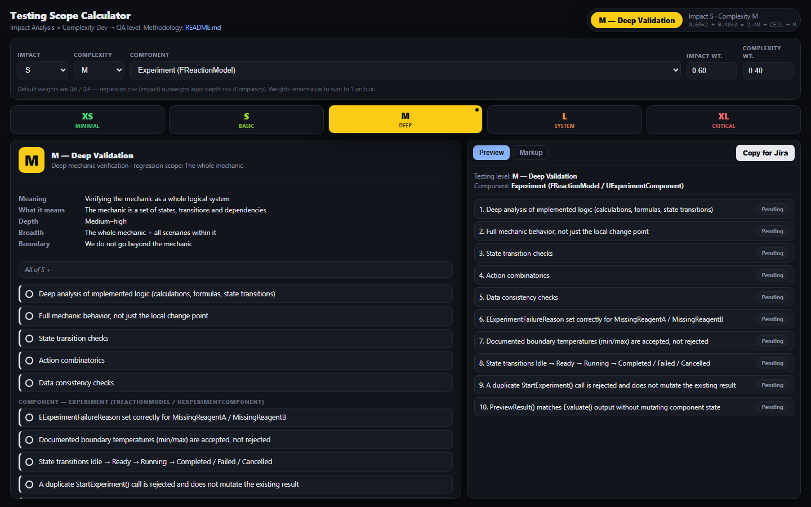

<h1 align="center" style="color:FireBrick">
    Testing Scope Framework
</h1>

<p align="center">
   <b>Hi everyone!</b>
</p>

<b>Table of contents:</b>

* [Can we expect two independent QA engineers to complete the same task with the same result?](#can-we-expect-two-independent-qa-engineers-to-complete-the-same-task-with-the-same-result)
* [A universal AAA checklist does not exist.](#a-universal-aaa-checklist-does-not-exist)
* [Why This Exists](#why-this-exists)
* [Scope](#scope)
* [Base Workflow](#base-workflow)
* [The Testing Matrix](#the-testing-matrix)
* [Framework](#framework)
* [Testing Levels](#testing-levels)
* [The Final Checklist](#the-final-checklist)
* [Best Practices](#best-practices)
* [Common Pitfalls](#common-pitfalls)

___

A methodology for determining an objective, reproducible testing level for a task (feature/bugfix) based on two independent axes — **Impact Analysis** and **Complexity Dev** — instead of a gut call that depends on which QA engineer happens to pick it up.

This document doesn't replace a QA engineer's analytical thinking — it sets a **minimum guaranteed level of verification**, predictable regardless of who ends up testing the task.

## Can we expect two independent QA engineers to complete the same task with the same result?

*Risk-based test design · Production practice*

Imagine two identical parallel universes with one exception: the QA engineer assigned to the task. How can we shape the QA process for an AAA system with a complex Core Gameplay structure so that we can expect the same result in both universes?

**My experience in AAA suggests that the individual specialist has too much influence on the outcome. So what can we do about it?**

**Same task. Different reasoning.**

Identical input — same change request:

- Universe A — QA_A — Personal interpretation — Scope A
- Universe B — QA_B — Personal interpretation — Scope B

Experience and individual interpretation can produce two valid-looking but materially different test scopes.

Individuality is valuable — until it leads to a poor outcome. Individuality can create frameworks like this. It can also create the reasons such frameworks are needed.

When we talk about quality, we mean bringing the expected and actual results into alignment. We cannot accept a situation in which we do not know what to expect.

## A universal AAA checklist does not exist.

*The original problem*

A check is not inherently mandatory or optional.

This makes it important not to settle for the apparently safest conclusion: test everything. In an AAA environment, deciding what does not need to be tested is the hardest — and perhaps the most important — question.

This framework builds that decision around three parameters:

| # | Parameter | Question |
|---|---|---|
| 01 | **Testing depth** | How thoroughly should the changed behavior itself be examined? |
| 02 | **Testing breadth** | How far should regression expand across connected systems? |
| 03 | **Distrust in the logic** | Where does an experienced QA engineer believe the calculated minimum is insufficient? |

Depth defines vertical coverage. It determines how many rules, states, boundaries, combinations and failure paths must be investigated inside the changed functionality.

Distrust is the space for individuality and QA expertise. It is always applied on top of the depth and breadth calculation — and it remains visible, explainable and open to discussion.

Full product → Connected systems → Feature boundaries → Changed behavior.

Maximum coverage is not automatically maximum quality. When every layer is treated as equally necessary, scope becomes expensive but the reasoning behind it remains invisible.

The framework helps explain what does not need to be tested — and why.

## Why This Exists

Without a formal criterion, testing scope gets decided subjectively: one engineer regresses everything "just in case," another stops at the happy path. Both outcomes are a problem — over-testing burns the team's time, under-testing lets risk slip through.

The framework solves this by splitting testing scope into two independent concepts that already exist in most trackers:

- **Impact Analysis** — says **how much** to test (regression breadth)
- **Complexity Dev** — says **how deep** to test (logic-validation depth)

The resulting value — **Impact Analysis QA** — is a concrete testing level (XS–XL) with a clear list of mandatory checks.

## Scope

The framework applies to branches that fit the Base Workflow:

- new functionality
- fixes for old or new problems (bugfixes)
- refactors and technical changes that don't affect user experience
- experimental R&D-style changes and hypothesis testing

> [!WARNING]
> The framework **does not apply** to the hotfix process — branches that meet the criteria of urgency or any other emergency activity. Hotfix branches need a separate, faster process (a Hot Workflow), which this document does not cover.

## Base Workflow

The sequence of actions when working a task that falls within scope:

1. Read the task and all attached documentation
2. Review the task's Impact Analysis
3. Review the task's Complexity Dev
4. Check that the assigned Impact and Complexity Dev actually hold up — QA doesn't just execute these values, it validates them
5. Test according to the finalized Impact and Complexity Dev
6. Finalize the QA process where needed (advancing the Bug Life Cycle)

> [!IMPORTANT]
> Step 4 is the critical one: the correctness of the assigned values determines how sane the entire downstream scope of work will be. Validating Impact/Complexity requires clear criteria for assigning them in the first place.

## The Testing Matrix

The resulting testing level (**Impact Analysis QA**) is calculated with the following formula:

```
full_weight = impact_weight + complexity_weight = 1

impact_analysis_qa = impact_weight * impact_level_value + complexity_weight * complexity_level_value
```

Base values:

| Parameter | Value |
|---|---|
| `impact_weight` | 0.6 |
| `complexity_weight` | 0.4 |
| `level_value`: XS / S / M / L / XL | 1 / 2 / 3 / 4 / 5 |

Impact Analysis carries more weight than Complexity Dev, because regression risk (breadth) takes priority over the depth of validating new logic.

The result is rounded **up** (a safety margin) and clamped to the 1–5 range.

**Example:** Impact = XS (1), Complexity = S (2):

```
impact_analysis_qa = 0.6 * 1 + 0.4 * 2 = 1.4 → CEIL → 2 = S
```

The full result matrix at the base weights:


> [!CAUTION]
> If a task has no Complexity Dev assigned, the simplification `Impact Analysis QA = Impact Analysis` is allowed, but it's not recommended — it increases the margin of error in determining the level. Any missing values that matter for QA's downstream work should be flagged to the task's author.

## Framework

[](framework.html)

[`framework.html`](framework.html) — a self-contained HTML tool (no build step, no dependencies, opens straight in a browser) that implements the formula above:

- pick Impact Analysis and Complexity Dev (XS–XL)
- adjustable weights that auto-normalize to sum to 1
- a visualization of the resulting level and a breakdown of the calculation (`Score = ... → CEIL → level`)
- a checklist for the selected level that inherits checks from lower levels ("all of XS +," "all of S +," etc.)
- export of the final checklist as markup ready to paste into a ticket comment (Jira wiki markup)

> [!NOTE]
> Framework (`framework.html`) is a proof-of-concept demo: the per-level checklists cover the general case, not an exhaustive list of checks, and the progress indicators on the level cards aren't interactive yet. Filling in more detailed scenarios per level is still an open task.

## Testing Levels

The differences between levels come down to three concepts:

1. **Check depth** — set by Complexity Dev (for example: verify not just the final result, but the correctness of the intermediate calculation/formula the logic relies on)
2. **Check breadth** — set by Impact Analysis (for example: verify not just the changed module, but its effect on adjacent modules — regression)
3. **Distrust of the logic** — a subjective factor, but always present (for example: "this dependency sounds illogical and risky")

> [!NOTE]
> The number of concrete cases is only an indirect consequence of analyzing these three concepts, so a single testing standard covering 100% of tasks is impossible. What follows describes typical behavior for the majority of cases.

The running example is the **Reaction Experiment** mechanic from [qalab](https://github.com/msgrigorovich/qalab), a test Unreal Engine project: `FReactionModel::Evaluate` takes `AmountA` / `AmountB` / `Temperature` as inputs and computes `Yield` (reaction output) and `ReactionTime`, while `UExperimentComponent` wraps that pure function in an `Idle → Ready → Running → Completed/Failed/Cancelled` state machine.

### Impact Analysis QA = XS — Minimal Validation

**Goal:** verifying a local change. **Regression scope:** the change point.

| Parameter | Description |
|---|---|
| Meaning | Verifying the correctness of a specific change without analyzing the system |
| What it means | We check that the change works at its point of application, but don't explore behavior beyond it |
| Depth | Surface-level (no logic analysis) |
| Breadth (regression) | The change point only — the specific scenario the task was made for |
| Level boundary | Alternative paths, states, and dependencies are not checked |

**Example task:** add a boolean flag `bSafetyLockEnabled` to `FExperimentParameters` that makes `UExperimentComponent::StartExperiment()` return `false` immediately, without starting the reaction.

- Flag = true → `StartExperiment()` → returns `false`, state doesn't transition to `Running`
- Flag = false → `StartExperiment()` → works as before, `FReactionModel::Evaluate` is called normally
- No regression checks — only the implemented flag

### Impact Analysis QA = S — Basic Validation

**Goal:** basic logic validation. **Regression scope:** the change point + nearby scenarios.

| Parameter | Description |
|---|---|
| Meaning | Verifying basic logic and obvious deviations |
| What it means | We check not just the happy path, but simple behavioral deviations too |
| Depth | Low (basic logic) |
| Breadth (regression) | The change point + its immediate surroundings — scenarios that directly use the same logic |
| Level boundary | Complex states and transitions are not checked |

**Example task:** replace the static flag with a constant threshold, `MaxSafeTemperature` — `FReactionModel::Validate` should now reject the reaction outright (instead of just penalizing `Yield`, as it does now) once `Temperature` exceeds that threshold.

- `Temperature` within the old safe range → behavior unchanged
- `Temperature` exceeds `MaxSafeTemperature` → `Validate` returns `false`, state → `Failed`, `FailureReason` is set
- `Temperature` == `MaxSafeTemperature` exactly → the reaction is still accepted (boundary is inclusive)
- Regression check: the documented boundary cases `MinimumTemperatureBoundaryIsAccepted` / `MaximumTemperatureBoundaryIsAccepted` from the existing test suite must not break below the new threshold

### Impact Analysis QA = M — Deep Validation

**Goal:** deep verification of the mechanic. **Regression scope:** the whole mechanic.

| Parameter | Description |
|---|---|
| Meaning | Verifying the mechanic as a complete logical system |
| What it means | We treat the mechanic as a set of states, transitions, and dependencies |
| Depth | Medium–high |
| Breadth (regression) | The whole mechanic + every scenario inside it |
| Level boundary | We don't go beyond the mechanic |

**Example task:** make `MaxSafeTemperature` depend not just on `Temperature`, but on the `AmountA`/`AmountB` ratio too — a heavily mismatched reagent ratio should lower the safe temperature threshold (the model already computes `RatioDeviation` for the `Yield` penalty; now it also drives the rejection threshold).

- Check each input parameter individually (`AmountA`/`AmountB`/`Temperature`: min/normal/max)
- Check every meaningful combination of parameters (balanced ratio + high temperature, mismatched ratio + moderate temperature, etc.)
- Check state transitions (`Ready → Failed` exactly at the new dynamic boundary, `Ready → Completed` just below it)
- Boundary cases for the new dependency
- Regression check: `OptimalRatioProducesExpectedYield` (the project's base happy-path test, `Yield == 100%`) must not change

### Impact Analysis QA = L — System Validation

**Goal:** system-level verification. **Regression scope:** the mechanic + adjacent systems.

| Parameter | Description |
|---|---|
| Meaning | Verifying the mechanic's interaction with other systems |
| What it means | We check not just the mechanic, but how it affects and depends on other systems |
| Depth | High |
| Breadth (regression) | The mechanic + related systems and interaction scenarios |
| Level boundary | Doesn't cover the whole product |

**Example task:** the new temperature-threshold rejection needs to reach `FRegressionAnalyzer` — an `AReactionTestStand` sweep that now hits the threshold more often must show up as a rising `FailureRate` in `CompareToBaseline()`, not get lost in averaged `Yield`/`ReactionTime` numbers.

- Full verification of the `FReactionModel`/`UExperimentComponent` logic described at the levels above
- Full regression of the Test Stand → Regression pipeline: `ComputeBaselineAggregatesRunRecordsPerMetric`, `IntentionalReactionTimeRegressionTriggersWarning`, `TooFewRunsSkipsComparison` — now with the new threshold engaged

### Impact Analysis QA = XL — Critical Validation

**Goal:** critical verification. **Regression scope:** cross-system / cross-team regression.

| Parameter | Description |
|---|---|
| Meaning | Verifying with the maximum level of distrust toward the system |
| What it means | We assume the system can break in unexpected places |
| Depth | Maximum |
| Breadth (regression) | Cross-system + cross-domain regression |
| Level boundary | Practically none (checks skew heavily toward negative scenarios) |

**Example task:** turn a rejection under the new threshold into a release-blocking signal — export it through `UQATelemetryLibrary` (CSV/JSON) and wire `FRegressionAnalyzer` to it, so an accidental shift in the threshold gets caught before it breaks the telemetry schema or the anchor tests the rest of the suite relies on (`OptimalRatioProducesExpectedYield`, `RunsPerConfigRepeatsSameConfigDeterministically`).

- Full verification of the entire `FReactionModel`/`UExperimentComponent` system and all adjacent modules (level L: Test Stand, Regression, Telemetry)
- Heavy focus on atypical, extreme, and rarely-seen scenarios (for example, the threshold collapses below the documented minimum temperature — the mechanic starts rejecting every configuration)
- Check the `InteractionComponent`/stations that configure and trigger the experiment — did the player-facing scenarios break when the valid parameter range changed?
- Performance: `Validate()` now does more work per call — a sweep across many configs and runs (`AReactionTestStand`) must not noticeably slow down
- Mandatory cross-team testing involvement from the owners of adjacent systems

## The Final Checklist

A summary table of check types and whether they're mandatory at each level (`+` mandatory, `-` not required):

| Check type | XS | S | M | L | XL |
|---|---|---|---|---|---|
| Requirement compliance | + | + | + | + | + |
| Change point verification | + | + | + | + | + |
| Positive scenarios | + | + | + | + | + |
| Negative scenarios | - | + | + | + | + |
| Boundary values | - | + | + | + | + |
| State transition checks | - | - | + | + | + |
| Action combinatorics | - | - | + | + | + |
| Calculation / formula checks | - | - | + | + | + |
| Data consistency checks | - | - | + | + | + |
| Mechanic checks (end-to-end) | - | - | + | + | + |
| System interaction checks | - | - | - | + | + |
| Local mechanic regression | - | - | - | + | + |
| Adjacent mechanic regression | - | - | - | + | + |
| Full regression across all mechanics | - | - | - | - | + |
| Non-standard scenarios | - | - | - | - | + |
| Extreme conditions | - | - | - | - | + |
| Performance | - | - | - | - | + |
| Cross-team involvement | - | - | - | - | + |

## Best Practices

The practices below apply both to new-functionality tasks and to bug reproduction work.

### Working with logic-level debugging

For tasks at testing level ≥ M, engaging with the underlying logic (not just the UI/end behavior) becomes necessary:

- disconnecting part of the logic from the main function and verifying the change point in isolation
- logging the function call to verify it matches the triggers described in the requirements
- setting a breakpoint on the relevant function to verify the call itself and its context
- directly manipulating internal state to recreate combinations of situations that are hard or slow to reach through a normal user scenario

When several previously independent functions/modules get merged, you need to test not just the new combined logic, but regression on the logic that used to be scattered across separate places.

### Working with logs

Timely logging is one sign of a system behaving as expected. Insufficient logging is a reason to send the task back for rework; excessive logging is a potential performance problem.

Logs are especially useful when calls happen within a short window and the difference between two similar conditions isn't visible to the naked eye (for example, a race between two nearly-simultaneous triggers). In cases like that, the only reliable way to confirm which condition actually fired is checking the logs — not watching the end behavior.

### Working with performance profiling

> [!NOTE]
> Pulling a performance trace is usually a consequence of distrust toward the system or a subjective sense that things got slower, but sometimes it has to happen on schedule (for example, if new logic now runs every frame/tick instead of once).

Practice: recreate the situation that triggers the new logic, capture a trace before and after the change, and compare the time cost of the affected path.

### Working with test benches

> [!TIP]
> Working with test benches (test environments with a fixed set of situations) and repeatable test scenarios is one of the key objective testing practices. Using a bench as a mandatory acceptance criterion is recommended for tasks where the result is hard to judge by eye (changes to probabilistic/statistical mechanics, ML models, ranking, etc.).

Practice: create separate "before" and "after" branches/environments (without reusing existing working branches, to avoid polluting their diffs), run the same bench of situations against both, and compare the aggregated statistics.

### Working with telemetry

Telemetry is one of the key objective acceptance criteria, alongside test benches. Its range of use is broad — from verifying an event fires correctly to assessing the severity and priority of a bug that can't be reproduced manually.

Practice: formulate the problem as a logical condition, translate it into a query against the analytics store, and get the reproduction rate before and after the fix — this turns priority assessment from a guess into a measurable number.

> [!CAUTION]
> With badly chosen query conditions, telemetry data will "lie" — doing more harm than good — so it's worth bringing in the analytics team to validate complex queries.

### Working with a Pull Request diff

Analyzing the diff is a preventive way to surface risks that aren't always obvious from the task description:

- breadth of the affected functionality → how important regression checks are
- depth of the changes → how localized the implemented logic is
- new files or changes in specific paths (networking code, build configuration, etc.) → which extra configurations/build types need separate verification if CI doesn't cover them by default

> [!TIP]
> A useful practice, though not a substitute for manual analysis — feed the PR diff to an LLM to generate extra check and risk ideas; the resulting feedback gets more valuable as the model has more context about the project's specifics.

### Reusable test scenarios

Most tasks reproduce similar situations using the same tricks (debug configurations, test scripts, saved scenarios). If the team can save and reuse these building blocks (snippets, saved logic graphs, telemetry query templates), it's worth keeping a library of them — it cuts prep time for testing similar tasks significantly down the line.

## Common Pitfalls

Most common problems come from bad input data, not from QA's own mistakes:

- a vaguely stated task goal
- a goal that stopped being relevant by the time testing started
- an uninformative Pull Request / Merge Request description
- a backlog task everyone just wants closed quickly
- an incorrectly assigned Impact Analysis or Complexity Dev — or none assigned at all
- a PR that hasn't been rebased onto its target branch in a long time
- key task information living in DMs or stale chat threads instead of the ticket

A separate category is problems on the testing side itself: checks were only run in one environment configuration (for example, only locally, without the distributed/networked mode, if it applies to the product), or testing happened on a stale branch, and the resulting conflict forced part of the checks to be redone.

___

<b>Table of contents:</b>

* [Can we expect two independent QA engineers to complete the same task with the same result?](#can-we-expect-two-independent-qa-engineers-to-complete-the-same-task-with-the-same-result)
* [A universal AAA checklist does not exist.](#a-universal-aaa-checklist-does-not-exist)
* [Why This Exists](#why-this-exists)
* [Scope](#scope)
* [Base Workflow](#base-workflow)
* [The Testing Matrix](#the-testing-matrix)
* [Framework](#framework)
* [Testing Levels](#testing-levels)
* [The Final Checklist](#the-final-checklist)
* [Best Practices](#best-practices)
* [Common Pitfalls](#common-pitfalls)

___

<p align="center">
    I hope this framework helps make the QA testing scope on your tasks more predictable.
</p>
<p align="center">
    <b>Best regards, Diana Grigorovich!</b>
</p>
<h1 align="center" style="color:FireBrick">
    Thanks for your attention!
</h1>
